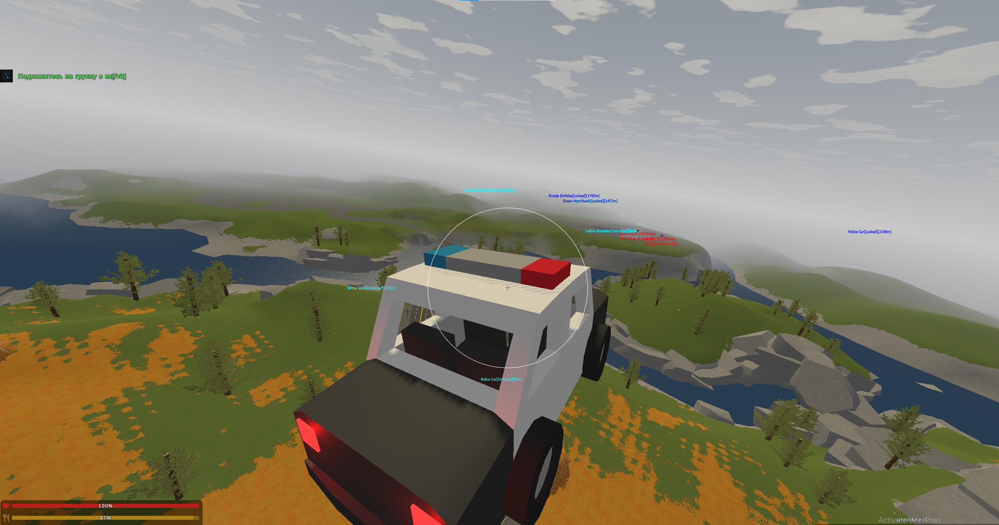
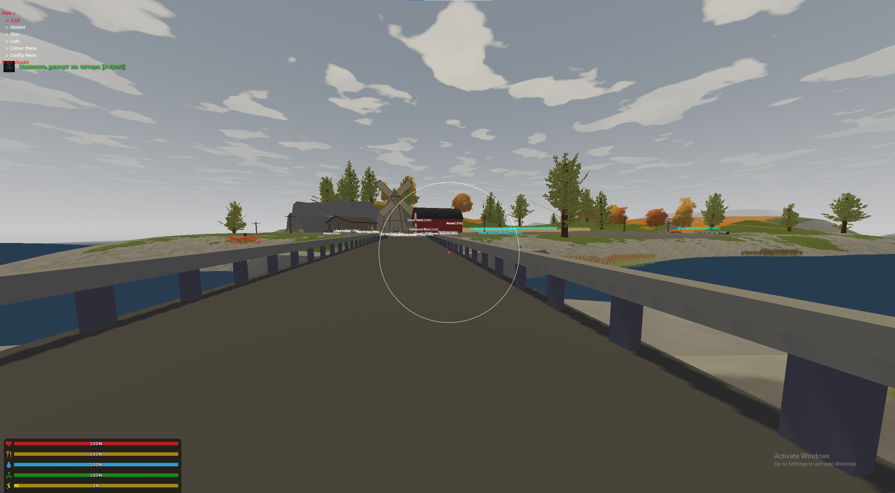
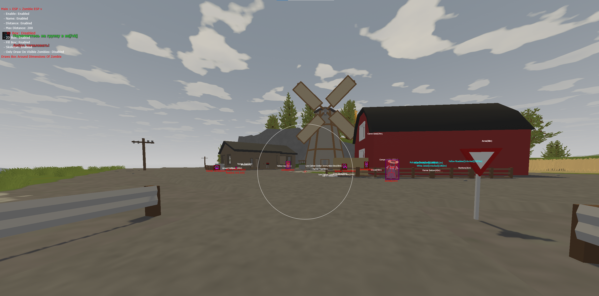
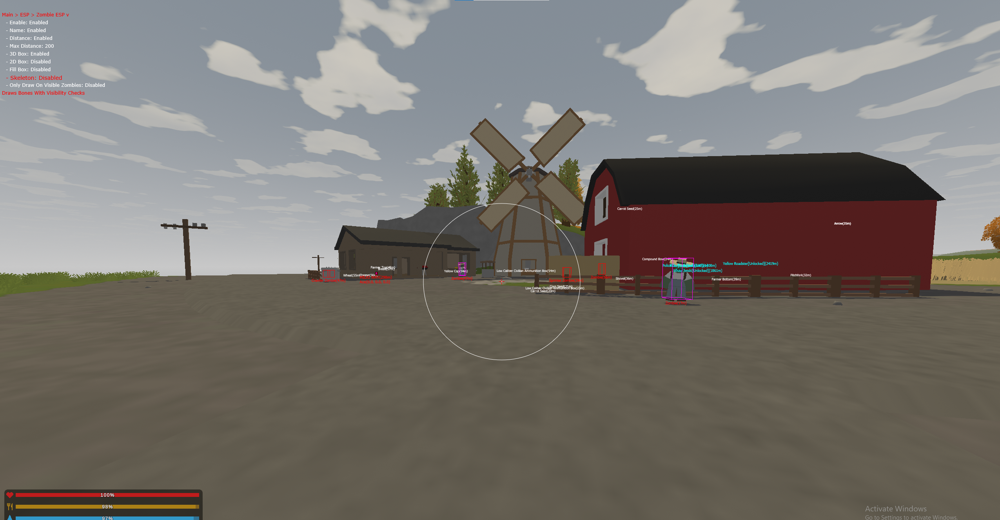

# Unturned
The idea for this project was just a fun streamproof renderer on unturned. Originally everything was stream proof but then the game faffed about with spread while i wasn't maintaining it. I readded nospread but a none streamproof version. 

  

 
The project was just a bit of fun to make a cheat for a simple game. thats all.

## Images:

  

 

  

 

  

 

  

 
